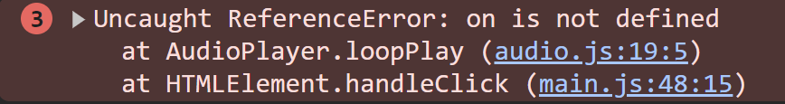

bㅠ# 네이버 로그인 페이지 구현

---

썸네일 이미지를 클릭하면 메인 이미지와 배경이 바뀔 수 있도록 코드 로직을 작성해주세요.


---
## 요구사항

1. 이벤트 처리 방식을 사용하여 클릭 이벤트를 걸어주세요.
    1. 이벤트 위임
    2. 반복문
2. 이미지와 색상의 데이터는 `data.js` 에서 불러와주세요.
3. 각 li 항목들을 클릭하면 배경 색상과 메인 비주얼 이미지를 변경해주세요.
    1. 배경색 변경 ( colorB의 기본값은 `#000` 으로 한다 )


# 문제점 및 궁금점

1. audioPlayer 구성이 어려웠음.
> 코드를 보는데 이게 어떤식으로 흘러가는지 이해가 잘 안되었음. 그래서 gpt 의 도움을 받았음.

2. 그 외에
> 과제 구성이 수업시간 때 했던 내용이랑 상당수 비슷해서 큰 무리는 없었음. 오디오 구성 빼고는. </br> 다만 아직은 참고하면서 코딩하기 때문에 더욱 연습이 필요함.

# 개발자 도구에서 에러가 확인됨.


</br>

참조에러 같은데, AudioPlayer.loopPlay 에서 on 이라는 것이 정의되지 않았다 라고 보임. 아직 해결방법을 찾지못함.

# data.js 수정

</br>

```js
const data = [
  {
    color: ["#ff6a00", "#720400"],
    name: "EMBER",
    alt: "엠버 포스터",
    src: "ember.jpeg",
    audio: "ember.m4a",
  },
  {
    color: ["#1ca9f8", "#000054"],
    name: "WADE",
    alt: "웨이드 포스터",
    src: "wade.jpeg",
    audio: "wade.m4a",
  },
  {
    color: ["#98d00f", "#002906"],
    name: "CLOD",
    alt: "클로드 포스터",
    src: "clod.jpeg",
    audio: "clod.m4a",
  },
  {
    color: ["#d968e6", "#30003c"],
    name: "GALE",
    alt: "게일 포스터",
    src: "gale.jpeg",
    audio: "gale.m4a",
  },
];
```

# 작동 영상


</br>

